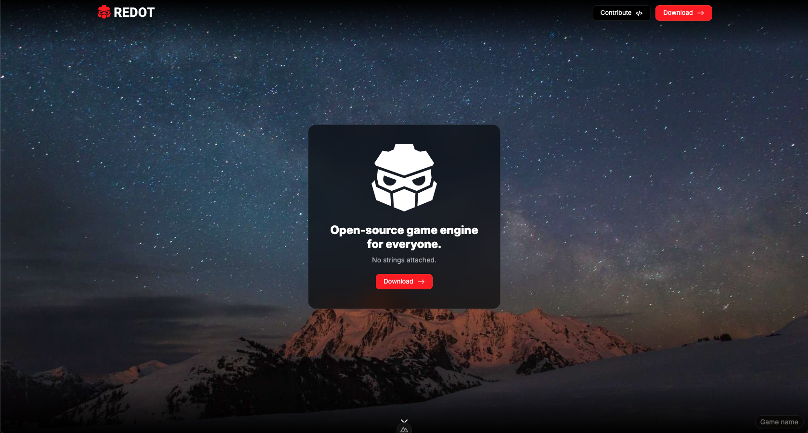

<h1># Redot Game Engine Website</h1>

Welcome to the Redot Game Engine Website project! This repository is the front-end platform for our community-driven website, providing documentation, resources, and community features for the Redot game engine.

 
  

## 🚀 Features

- 🌟 **Comprehensive Documentation**: Easily browse and search through Redot's game engine documentation.
- 🛠️ **Developer Tools**: Access tool integrations and guides to enhance your game development experience.
- 🌍 **Community Hub**: Engage with other Redot users through discord, FAQs, and community events.
- 💻 **Responsive Design**: A fully responsive site that looks great on any device.

## 🛠️ Technologies Used

This project uses the following technologies:

- **Vue 3**: For building the user interface.
- **JavaScript & TypeScript**: Core scripting languages for dynamic functionality.
- **SCSS & CSS**: Styling for creating a responsive and modern design.
- **Node.js & npm**: For package management and running development tools.

### 🙌 Contributing:
We welcome contributions from everyone! To get started, please read our [Contributing information](https://github.com/YanLi-FE/redot-landing-page/blob/main/CONTRIBUTING.md) to learn how to contribute to the project, set up the development environment, and submit pull requests.
We expect all contributors to uphold our community standards. Please review our [Code of Conduct](https://github.com/YanLi-FE/redot-landing-page/blob/main/CODE_OF_CONDUCT.md) to learn more about our expectations regarding respectful collaboration and behavior.