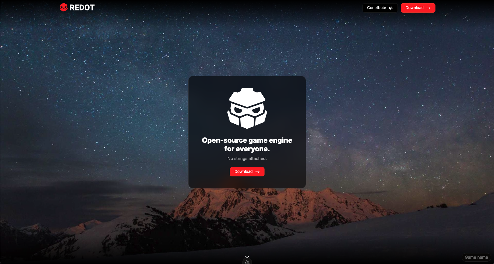

<div style="text-align: center;">

# Redot Game Engine Website (Archived)

> **Notice**: This repository is now archived and will no longer be updated. The new, active repository can be found here: https://github.com/Redot-Engine/redot-website.

Welcome to the archived Redot Engine Website project! This repository is the front-end platform for our community-driven website, providing documentation, resources, and community features for the Redot game engine.

<br>
  
</div>

## 🚀 Features

- 🌟 **Comprehensive Documentation**: Easily browse and search through Redot's game engine documentation.
- 🛠️ **Developer Tools**: Access tool integrations and guides to enhance your game development experience.
- 🌍 **Community Hub**: Engage with other Redot users through discord, FAQs, and community events.
- 💻 **Responsive Design**: A fully responsive site that looks great on any device.

## Running locally

### Prerequisites

Make sure [nodejs](https://nodejs.org/en/download/) is installed.

### To build and run

```
npm install
npm run dev
```

### Public images and image compression

Place public images in `public_images` folder.

For compressing image,

```
npm run compress-image
```

⚠️ Most of time you wouldn't need to run this. This is going to remove old images and create new compressed images.

## 🛠️ Technologies Used

This project uses the following technologies:

- **Vue 3**: For building the user interface.
- **JavaScript & TypeScript**: Core scripting languages for dynamic functionality.
- **SCSS & CSS**: Styling for creating a responsive and modern design.
- **Node.js & npm**: For package management and running development tools.

### 🙌 Contributing:

We welcome contributions from everyone! To get started, please read our [Contributing information](https://github.com/redot-engine/redot-landing-page/blob/main/CONTRIBUTING.md) to learn how to contribute to the project, set up the development environment, and submit pull requests.
We expect all contributors to uphold our community standards. Please review our [Code of Conduct](https://github.com/redot-engine/redot-landing-page/blob/main/CODE_OF_CONDUCT.md) to learn more about our expectations regarding respectful collaboration and behavior.
